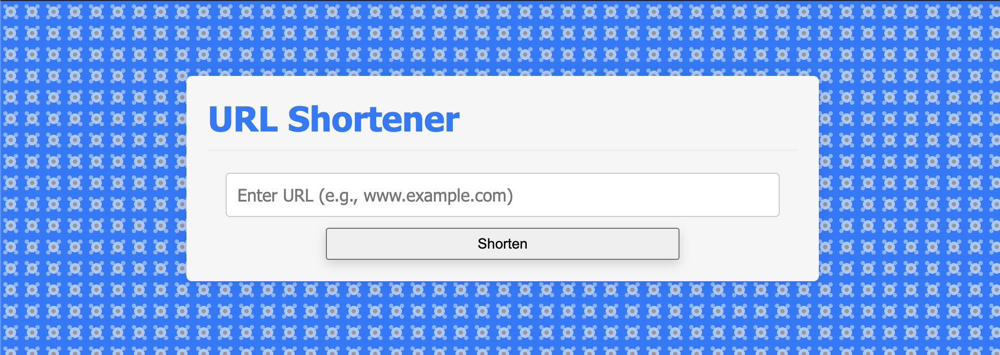

# url-shortener

### Description
Simple Flask app that interacts with a SQLite database. The app allows users to shorten URLs (e.g., www.example.com) using a dummy top-level domain (e.g., https://xyz.lol/v67UFd). The original-shortened url pairs are stored in and retrieved from the SQLite database, and displayed on the frontend.

